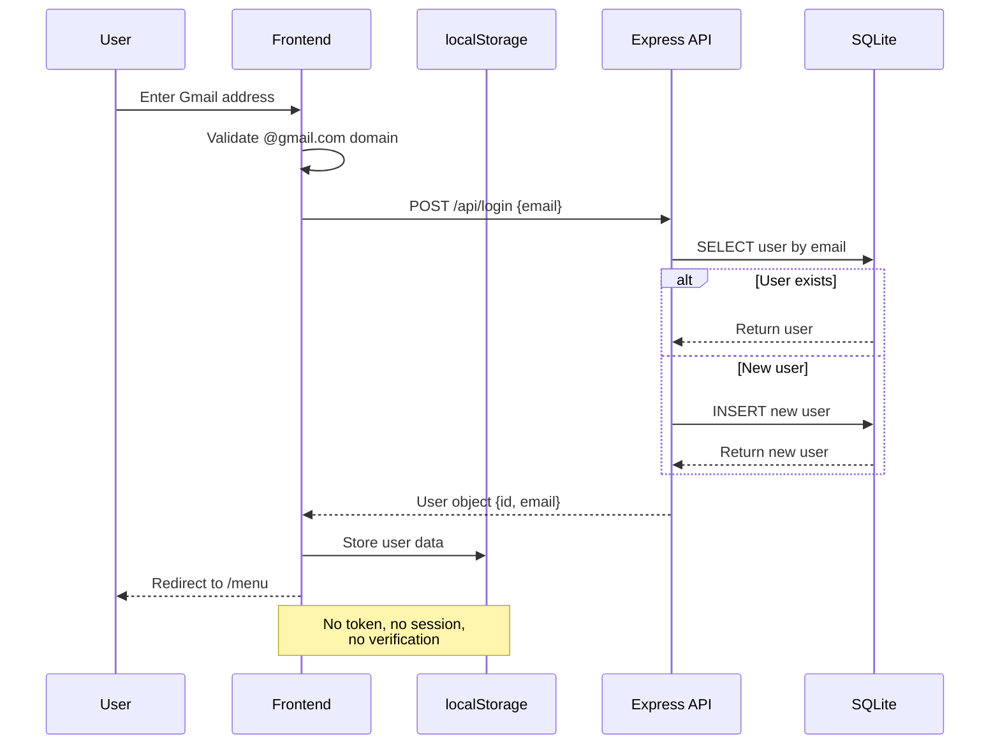
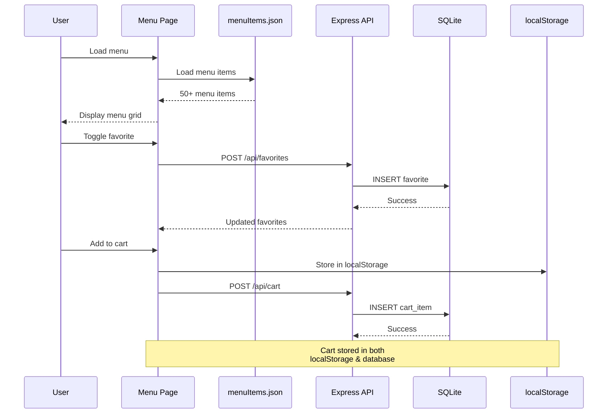

# COMPREHENSIVE SYSTEM ASSESSMENT REPORT
## Soul Good Restaurant Menu PWA

**Assessment Date:** February 15, 2026
**Assessed By:** Senior Software Architect
**Project Type:** Progressive Web Application (PWA)
**Current Status:** Active Development / Proof of Concept

---

## EXECUTIVE SUMMARY

This is a **restaurant menu PWA application** for "Soul Good Cafe" featuring an online menu browser, user authentication, favorites management, and shopping cart functionality. The project has undergone a recent architectural migration from a Supabase backend to a local Express + SQLite server.

**Key Findings:**
- ✅ Modern frontend stack with React 19, Chakra UI, and PWA capabilities
- ✅ Clean separation between frontend and backend
- ❌ **CRITICAL:** Multiple security vulnerabilities in authentication and authorization
- ❌ **CRITICAL:** Zero test coverage
- ⚠️ Production deployment readiness: **NOT READY**

**Overall Maturity Level:** **Early Stage / Proof of Concept**
**Recommended Action:** Address security issues immediately before any public deployment.

---

## ARCHITECTURAL DIAGRAM

```mermaid
graph TB
    subgraph "Client Layer"
        Browser[Web Browser]
        PWA[PWA Service Worker]
        LocalStorage[localStorage<br/>User Session & Cart]
    end

    subgraph "Frontend - React SPA"
        Router[React Router]
        Welcome[Welcome Page]
        Login[Login Page<br/>Gmail Only]
        Menu[Menu Page<br/>Filtering & Search]
        Cart[Cart Page]
        Verify[Verify Page<br/>DEPRECATED]

        Components[Components]
        MenuCard[MenuItemCard]
        Navbar[Navbar<br/>UNUSED]
        Loader[Loader]

        StaticData[menuItems.json<br/>50+ Items]
    end

    subgraph "Backend - Express API"
        Express[Express Server<br/>Port 3001]
        AuthAPI[/api/login]
        FavAPI[/api/favorites]
        CartAPI[/api/cart]
        HealthAPI[/api/health]

        CORS[CORS Middleware<br/>All Origins Allowed]
    end

    subgraph "Data Layer"
        SQLite[(SQLite Database<br/>database.sqlite)]
        Users[users table]
        Favorites[favorites table]
        CartItems[cart_items table]
        OTPs[otps table<br/>DEPRECATED]
    end

    subgraph "External Services"
        Supabase[Supabase<br/>REMOVED]
        EmailJS[EmailJS<br/>CONFIGURED/UNUSED]
    end

    Browser -->|HTTPS| PWA
    PWA -->|Cache Assets| Browser
    Browser -->|React| Router
    Router --> Welcome
    Router --> Login
    Router --> Menu
    Router --> Cart
    Router --> Verify

    Menu --> MenuCard
    Menu --> StaticData
    Login --> LocalStorage
    Cart --> LocalStorage
    Menu --> Components

    Login -->|POST /api/login| AuthAPI
    Menu -->|GET/POST/DELETE| FavAPI
    Cart -->|GET/POST/PUT/DELETE| CartAPI

    Express --> CORS
    CORS --> AuthAPI
    CORS --> FavAPI
    CORS --> CartAPI
    CORS --> HealthAPI

    AuthAPI -->|Query/Insert| Users
    FavAPI -->|Query/Insert/Delete| Favorites
    CartAPI -->|CRUD| CartItems

    SQLite --> Users
    SQLite --> Favorites
    SQLite --> CartItems
    SQLite --> OTPs

    style Browser fill:#e1f5ff
    style SQLite fill:#fff4e1
    style Express fill:#e8f5e9
    style Supabase fill:#ffebee
    style EmailJS fill:#ffebee
    style LocalStorage fill:#fff9c4
    style OTPs fill:#ffebee
    style Verify fill:#ffebee
    style Navbar fill:#ffebee
```

### Architecture Flow

**User Authentication Flow:**


**Menu Browsing & Cart Flow:**


---

## TECHNOLOGY STACK ANALYSIS

### Frontend Stack

| Technology | Version | Purpose | Status |
|-----------|---------|---------|---------|
| React | 19.1.1 | UI framework | ✅ Modern |
| Vite | 7.1.7 | Build tool & dev server | ✅ Modern |
| React Router | 7.9.2 | Client-side routing | ✅ Modern |
| Chakra UI | 2.10.9 | Component library | ✅ Stable |
| Framer Motion | 6.5.1 | Animations | ✅ Good |
| Swiper | 12.0.2 | Carousel | ✅ Good |
| vite-plugin-pwa | 1.0.3 | PWA capabilities | ✅ Good |
| Supabase JS | 2.57.4 | Former backend | ❌ UNUSED |
| EmailJS | 4.4.1 | Email service | ⚠️ UNUSED |

**Frontend Lines of Code:** ~960 lines (pages) + ~230 lines (components) = **~1,190 LOC**

### Backend Stack

| Technology | Version | Purpose | Status |
|-----------|---------|---------|---------|
| Node.js | Latest LTS | Runtime | ✅ Modern |
| Express | 4.18.2 | REST API | ⚠️ Outdated |
| SQLite3 | 5.1.6 | Database | ✅ Good |
| CORS | 2.8.5 | CORS handling | ✅ Good |
| Nodemon | 3.0.1 | Dev auto-reload | ✅ Good |

**Backend Lines of Code:** ~130 lines (server.js) + ~50 lines (db.js) = **~180 LOC**

**Total Application Code:** ~1,370 LOC

---

## PROJECT STRUCTURE

```
commission03/
├── server/                          # Backend (Express + SQLite)
│   ├── server.js                    # Main API server (129 lines)
│   ├── db.js                        # Database initialization
│   ├── database.sqlite              # SQLite database file
│   ├── package.json                 # Backend dependencies
│   └── README.md                    # API documentation
│
├── soul-good/                       # Frontend (React + Vite)
│   ├── src/
│   │   ├── pages/                   # Route pages
│   │   │   ├── Welcome.jsx          # Landing page
│   │   │   ├── Login.jsx            # Gmail authentication (172 lines)
│   │   │   ├── Menu.jsx             # Menu browser (422 lines)
│   │   │   ├── Cart.jsx             # Shopping cart (97 lines)
│   │   │   └── Verify.jsx           # DEPRECATED OTP page
│   │   ├── components/
│   │   │   ├── MenuItemCard.jsx     # Menu item display (231 lines)
│   │   │   ├── Navbar.jsx           # UNUSED component
│   │   │   └── Loader.jsx           # Loading spinner
│   │   ├── data/
│   │   │   └── menuItems.json       # Static menu data (434 lines)
│   │   ├── App.jsx                  # Router configuration
│   │   ├── main.jsx                 # React entry point
│   │   ├── supabaseClient.js        # STUB - removed
│   │   └── index.css                # Global styles
│   ├── public/                      # Static assets
│   │   ├── 1.png - 23.png           # Menu item images
│   │   └── soul-good-logo.png       # App logo
│   ├── vite.config.js               # Vite + PWA config
│   ├── eslint.config.js             # Linting rules
│   ├── package.json                 # Frontend dependencies
│   └── index.html                   # HTML entry point
│
└── README.md                        # Project overview
```

---

## CORE FEATURES ANALYSIS

### 1. Authentication System

**Current Implementation:** Gmail-only, passwordless authentication

**Flow:**
1. User enters Gmail address on `/login` page
2. Frontend validates `@gmail.com` domain
3. POST request to `/api/login` with email
4. Backend checks if user exists in database
   - If not: Creates new user record
   - If yes: Returns existing user data
5. User object stored in `localStorage`
6. Redirect to `/menu` on success

**Critical Issues:**

| Issue | Severity | Description |
|-------|----------|-------------|
| No email verification | CRITICAL | Accepts any `@gmail.com` address without verification |
| No session tokens | CRITICAL | No JWT, no session management |
| localStorage auth | CRITICAL | XSS vulnerability - tokens in localStorage |
| User ID spoofing | CRITICAL | API accepts `userId` in request body - no verification |
| No rate limiting | HIGH | Login endpoint vulnerable to brute force |
| Plain text storage | HIGH | Passwords stored as plain text (acknowledged in README) |
| No logout endpoint | MEDIUM | Only client-side `localStorage.removeItem()` |

### 2. Menu System

**Implementation:**
- Static JSON file: [menuItems.json](soul-good/src/data/menuItems.json) (434 lines)
- 50+ menu items with categories: Smoothies, Soul Coffee, Salads, Mains, Sides, Desserts
- Each item includes: id, name, category, description, price, image, calories, protein, tags, allergens

**Frontend Features:**
- Category filtering (7 categories)
- Search functionality (name + description)
- Auto-rotating promotional carousel (5-second intervals)
- Responsive grid layout (2-3 columns)
- Modal detail view with nutrition info
- Favorites toggle integration
- Add to cart functionality

**Architecture Issues:**

| Issue | Impact | Recommendation |
|-------|--------|----------------|
| Hard-coded JSON | HIGH | Menu changes require redeployment | Move to database |
| No admin panel | HIGH | No UI for menu management | Build CMS |
| Client-side only | MEDIUM | Large payload for extensive menus | Consider API pagination |
| No image optimization | MEDIUM | 23 PNG files, unknown sizes | Implement lazy loading |

### 3. Favorites Management

**API Endpoints:**
- `GET /api/favorites?userId=<id>` - Fetch user favorites
- `POST /api/favorites` - Add to favorites
- `DELETE /api/favorites` - Remove from favorites

**Database Schema:**
```sql
CREATE TABLE favorites (
  id INTEGER PRIMARY KEY AUTOINCREMENT,
  user_id INTEGER,
  item_id INTEGER,
  created_at DATETIME DEFAULT CURRENT_TIMESTAMP
)
```

**Issues:**
- ❌ No foreign key constraints
- ❌ No unique constraint (allows duplicate favorites)
- ❌ No index on `user_id` (slow queries for large datasets)
- ❌ `userId` passed in query/body - spoofing vulnerability

### 4. Shopping Cart

**API Endpoints:**
- `GET /api/cart?userId=<id>` - Fetch cart items
- `POST /api/cart` - Add item to cart
- `PUT /api/cart/:id` - Update quantity
- `DELETE /api/cart/:id` - Remove item

**Database Schema:**
```sql
CREATE TABLE cart_items (
  id INTEGER PRIMARY KEY AUTOINCREMENT,
  user_id INTEGER,
  item_id INTEGER,
  name TEXT,
  price REAL,
  quantity INTEGER,
  image TEXT,
  created_at DATETIME DEFAULT CURRENT_TIMESTAMP
)
```

**Implementation Notes:**
- Cart stored in both `localStorage` and database
- Quantity updates use PUT endpoint
- Frontend manages cart state locally
- No cart expiration policy

**Issues:**
- ❌ Duplicate data (localStorage + DB)
- ❌ No data validation (negative quantities, invalid prices)
- ❌ No cart synchronization on login
- ❌ Missing foreign key constraints

### 5. PWA Configuration

**Manifest:**
```javascript
{
  name: "Soul Good",
  short_name: "SoulGood",
  description: "View Soul Good menu and promotions",
  theme_color: "#FF7F50",
  background_color: "#ffffff",
  display: "standalone",
  start_url: "/"
}
```

**Features:**
- ✅ Auto-update service worker
- ✅ Installable on mobile/desktop
- ✅ Offline structure in place
- ❌ No offline caching strategy implemented
- ❌ No background sync for cart updates

---

## CODE QUALITY ASSESSMENT

### Modularity & Component Design

**Strengths:**
- ✅ Clear page-based separation (Welcome, Login, Menu, Cart)
- ✅ Reusable `MenuItemCard` component with modal
- ✅ Consistent Chakra UI styling system
- ✅ Responsive design with mobile-first approach
- ✅ Clean routing structure in [App.jsx](soul-good/src/App.jsx)

**Weaknesses:**
- ❌ Large [Menu.jsx](soul-good/src/pages/Menu.jsx:1) component (422 lines) - needs refactoring
- ❌ No prop validation (PropTypes or TypeScript)
- ❌ No custom hooks for data fetching
- ❌ Hardcoded API endpoints throughout components
- ❌ [Navbar.jsx](soul-good/src/components/Navbar.jsx) component exists but unused

**Recommended Refactoring:**
```javascript
// Extract custom hooks:
- useAuth() - Authentication logic
- useFavorites() - Favorites management
- useCart() - Cart operations
- useMenu() - Menu filtering/search

// Split Menu.jsx into:
- MenuPage.jsx - Container
- MenuGrid.jsx - Grid layout
- MenuFilters.jsx - Category/search filters
- PromoCarousel.jsx - Promotional slider
```

### Error Handling

**Frontend Pattern:**
```javascript
// Typical implementation:
try {
  const res = await fetch("/api/cart");
  const data = await res.json();
  if (!res.ok) throw new Error(data?.error || "Failed");
  // success
} catch (err) {
  console.error(err);
  alert(err.message); // ❌ Poor UX
}
```

**Issues:**
- ❌ `alert()` for error display (bad user experience)
- ❌ Limited error context for debugging
- ❌ No retry logic for failed requests
- ❌ No timeout handling
- ❌ No global error boundary

**Backend Pattern:**
```javascript
// Minimal validation:
if (!email) return res.status(422).json({ error: "Missing email" });

db.run(sql, [params], (err) => {
  if (err) {
    return res.status(500).json({ error: err.message }); // ❌ Exposes internals
  }
});
```

**Issues:**
- ❌ No input sanitization
- ❌ Error messages expose implementation details
- ❌ No request logging
- ❌ Callback hell (not using promises/async-await)
- ❌ No centralized error handling middleware

### Performance Analysis

**Frontend Optimizations:**
- ✅ `useMemo` for filtered menu items
- ✅ `useMemo` for category calculations
- ❌ No image lazy loading
- ❌ No code splitting
- ❌ Large component bundle (422-line Menu.jsx)
- ❌ 35 floating SVG icons rendered on Menu page

**Backend Performance:**
- ❌ Serial database callbacks (not using promises)
- ❌ No query indexing
- ❌ No connection pooling
- ❌ Synchronous `serialize()` calls may block event loop
- ⚠️ SQLite single-writer limitation (acceptable for current scale)

**Recommendations:**
```javascript
// Frontend:
- Implement React.lazy() for route-based code splitting
- Add  for menu images
- Consider virtual scrolling for long menu lists

// Backend:
- Convert callbacks to async/await
- Add database indexes on frequently queried fields
- Implement query result caching (Redis or in-memory)
```

### Security Vulnerabilities

**CRITICAL Issues:**

1. **Authentication Bypass**
   - No email verification - accepts any `@gmail.com` address
   - No session tokens (JWT) - relies on `localStorage`
   - User ID in request body - easily spoofed
   - **Impact:** Full unauthorized access to any user's data

2. **Authorization Missing**
   - No middleware to verify authentication
   - All API endpoints accept `userId` parameter without validation
   - **Example:** Anyone can fetch/modify cart for user ID 5 by sending `userId: 5`

3. **Data Exposure**
   - CORS allows all origins (`origin: true`)
   - Error messages expose database structure
   - `.env` file with secrets in version control
   - **Impact:** Information disclosure, credential exposure

4. **Input Validation**
   - No sanitization on user inputs
   - SQL injection prevented by parameterization ✅
   - XSS risk from unsanitized data in React ⚠️ (React escapes by default)

5. **Secrets Management**
   - Supabase keys hardcoded in `.env` (though unused)
   - `.env` likely committed to Git
   - No server-side environment config

**HIGH Priority Issues:**

- No HTTPS enforcement
- No rate limiting on API endpoints
- Plain text password storage (acknowledged in [server/README.md](server/README.md))
- localStorage for session storage (XSS vulnerability)
- No CSRF protection

**Security Scoring:**

| Category | Score | Status |
|----------|-------|--------|
| Authentication | 2/10 | ❌ Critical |
| Authorization | 1/10 | ❌ Critical |
| Data Protection | 3/10 | ❌ Critical |
| Input Validation | 5/10 | ⚠️ Needs Work |
| Secrets Management | 3/10 | ❌ Critical |
| **Overall Security** | **2.8/10** | ❌ **NOT PRODUCTION READY** |

---

## TESTING COVERAGE

**Current Status:** ❌ **ZERO TEST COVERAGE**

- No testing framework installed
- No unit tests
- No integration tests
- No E2E tests
- Only manual browser testing

**Testing Recommendations:**

### Unit Testing (Backend)
```javascript
// Install: vitest, supertest
describe('POST /api/login', () => {
  it('creates new user for valid gmail', async () => {
    const res = await request(app)
      .post('/api/login')
      .send({ email: 'test@gmail.com' });
    expect(res.status).toBe(200);
    expect(res.body).toHaveProperty('id');
  });

  it('returns 422 for invalid email', async () => {
    const res = await request(app)
      .post('/api/login')
      .send({ email: 'invalid' });
    expect(res.status).toBe(422);
  });
});
```

### Component Testing (Frontend)
```javascript
// Install: vitest, @testing-library/react
describe('MenuItemCard', () => {
  it('renders item details correctly', () => {
    render(<MenuItemCard item={mockItem} />);
    expect(screen.getByText('Mock Item')).toBeInTheDocument();
  });

  it('opens modal on click', async () => {
    render(<MenuItemCard item={mockItem} />);
    await userEvent.click(screen.getByRole('button'));
    expect(screen.getByRole('dialog')).toBeInTheDocument();
  });
});
```

### E2E Testing
```javascript
// Install: playwright or cypress
test('user can add item to cart', async ({ page }) => {
  await page.goto('/login');
  await page.fill('[name="email"]', 'test@gmail.com');
  await page.click('button[type="submit"]');

  await page.waitForURL('/menu');
  await page.click('[data-testid="menu-item-1"]');
  await page.click('[data-testid="add-to-cart"]');

  await page.goto('/cart');
  await expect(page.locator('[data-testid="cart-item"]')).toHaveCount(1);
});
```

**Recommended Testing Stack:**
- **Vitest** - Unit tests (modern, fast, Vite-native)
- **React Testing Library** - Component tests
- **Playwright** - E2E tests
- **MSW** (Mock Service Worker) - API mocking

**Target Coverage:** 80%+ for critical paths (auth, cart, favorites)

---

## BUILD & DEPLOYMENT

### Development Setup

**Frontend:**
```bash
cd soul-good
npm install
npm run dev      # Vite dev server (http://localhost:5173)
npm run build    # Production build
npm run lint     # ESLint check
npm run preview  # Preview production build
```

**Backend:**
```bash
cd server
npm install
npm run dev      # Nodemon (http://localhost:3001)
npm start        # Single run
```

**Vite Configuration:**
```javascript
// vite.config.js
export default defineConfig({
  plugins: [
    react(),
    VitePWA({
      registerType: 'autoUpdate',
      manifest: { /* ... */ }
    })
  ],
  server: {
    proxy: {
      '/api': 'http://localhost:3001' // Dev only
    }
  }
})
```

**Issues:**
- ❌ No production environment configuration
- ❌ API proxy only works in development
- ❌ Hardcoded backend URL in production
- ❌ No Docker containerization
- ❌ No CI/CD pipeline

### Production Deployment Gaps

**Missing:**
1. ❌ No Dockerfile for containerization
2. ❌ No environment-based config (dev/staging/prod)
3. ❌ No deployment documentation
4. ❌ No database migration strategy
5. ❌ No backup strategy for SQLite
6. ❌ No logging infrastructure (Winston, Pino)
7. ❌ No monitoring (New Relic, Datadog)
8. ❌ No error tracking (Sentry)
9. ❌ No load balancing setup
10. ❌ No SSL/TLS configuration

**Deployment Checklist for Production:**
```markdown
[ ] Set up environment variables properly
[ ] Implement HTTPS/SSL
[ ] Configure CORS for specific domains
[ ] Add request logging
[ ] Set up database backups
[ ] Implement rate limiting
[ ] Add health check endpoints
[ ] Configure error tracking
[ ] Set up monitoring dashboards
[ ] Create rollback strategy
[ ] Document deployment process
[ ] Load test application
```

---

## CONFIGURATION & DEPENDENCIES

### Environment Configuration

**Frontend `.env`:**
```
VITE_SUPABASE_URL=...        # ⚠️ Publicly exposed (unused)
VITE_SUPABASE_ANON_KEY=...   # ⚠️ Secrets exposed (unused)
VITE_EMAILJS_SERVICE=...     # Configured but unused
VITE_EMAILJS_TEMPLATE=...
VITE_EMAILJS_PUBLIC_KEY=...
```

**Issues:**
- ⚠️ Secrets likely committed to version control
- ⚠️ `.env` may not be in `.gitignore`
- ❌ No server-side environment config
- ❌ Hardcoded API endpoint (`http://localhost:3001`)

### Dependency Analysis

**Frontend (15 dependencies):**

| Dependency | Status | Notes |
|-----------|--------|-------|
| react, react-dom | ✅ Modern (19.1.1) | Latest stable |
| @chakra-ui/* | ✅ Good (2.x) | UI framework |
| vite | ✅ Modern (7.1.7) | Build tool |
| react-router | ✅ Modern (7.9.2) | Routing |
| @supabase/supabase-js | ❌ UNUSED | Remove |
| @emailjs/browser | ⚠️ UNUSED | Remove or implement |
| framer-motion | ✅ Good (6.5.1) | Animations |
| swiper | ✅ Good (12.0.2) | Carousel |
| lucide-react | ✅ Good (0.544.0) | Icons |

**Backend (3 dependencies):**

| Dependency | Status | Notes |
|-----------|--------|-------|
| express | ⚠️ Outdated (4.18.2) | Update to 4.19+ |
| sqlite3 | ✅ Good (5.1.6) | Database |
| cors | ✅ Good (2.8.5) | CORS handling |

**Recommendations:**
```bash
# Remove unused dependencies:
npm uninstall @supabase/supabase-js @emailjs/browser

# Update outdated:
npm update express

# Add essential missing:
npm install --save-dev vitest @testing-library/react
npm install jsonwebtoken bcrypt helmet express-rate-limit
```

---

## DOCUMENTATION QUALITY

### Available Documentation

| File | Status | Quality |
|------|--------|---------|
| `/README.md` | ✅ Present | High-level overview, setup instructions |
| `/server/README.md` | ✅ Present | API endpoints documented |
| `/soul-good/README.md` | ✅ Present | Frontend setup guide |
| Architecture docs | ❌ Missing | No ADRs or design docs |
| API specification | ❌ Missing | No OpenAPI/Swagger |
| Component docs | ❌ Missing | No Storybook or JSDoc |
| Deployment guide | ❌ Missing | No production instructions |

### Code Documentation

**Inline Comments:**
- ⚠️ Comments explain removed features (OTP, Supabase)
- ❌ No JSDoc comments on functions
- ❌ No inline documentation for complex logic
- ❌ No prop documentation

**Example - Missing Documentation:**
```javascript
// Current - no documentation:
export const MenuItemCard = ({ item, isFavorite, onFavoriteToggle, onAddToCart }) => {
  // 231 lines of code...
}

// Should have:
/**
 * MenuItemCard - Displays a menu item with image, details, and actions
 * @param {Object} item - Menu item object
 * @param {string} item.id - Unique item ID
 * @param {string} item.name - Item name
 * @param {boolean} isFavorite - Whether item is favorited
 * @param {Function} onFavoriteToggle - Callback when favorite toggled
 * @param {Function} onAddToCart - Callback when added to cart
 */
```

---

## TECHNICAL DEBT INVENTORY

### Critical Priority (Fix Immediately)

| # | Issue | Location | Impact | Effort |
|---|-------|----------|--------|--------|
| 1 | No email verification | [server/server.js:33](server/server.js#L33) | Anyone can login as any Gmail | 2 days |
| 2 | No auth middleware | [server/server.js:1-129](server/server.js) | API completely open | 1 day |
| 3 | User ID spoofing | All API endpoints | Full data access | 2 days |
| 4 | Zero test coverage | Entire project | Undetected regressions | 1 week |
| 5 | localStorage auth | [soul-good/src/pages/Login.jsx:172](soul-good/src/pages/Login.jsx#L172) | XSS vulnerability | 2 days |
| 6 | No DB constraints | [server/db.js](server/db.js) | Data integrity issues | 1 day |
| 7 | Secrets in .env | `.env` files | Credential exposure | 2 hours |
| 8 | Plain text passwords | [server/server.js:52](server/server.js#L52) | Security breach | 1 day |

**Estimated Total Effort:** 2-3 weeks

### High Priority (Before Production)

| # | Issue | Location | Impact | Effort |
|---|-------|----------|--------|--------|
| 9 | Static menu JSON | [soul-good/src/data/menuItems.json](soul-good/src/data/menuItems.json) | Deployment for updates | 3 days |
| 10 | No global state | Multiple components | Prop drilling, scaling issues | 2 days |
| 11 | Large Menu component | [soul-good/src/pages/Menu.jsx:1-422](soul-good/src/pages/Menu.jsx) | Maintainability | 1 day |
| 12 | Alert() error handling | Multiple components | Poor UX | 1 day |
| 13 | No pagination | API endpoints | Performance at scale | 2 days |
| 14 | CORS all origins | [server/server.js:15](server/server.js#L15) | Security risk | 1 hour |
| 15 | Callback hell | [server/server.js](server/server.js) | Maintainability | 1 day |
| 16 | No logging | Backend | Debugging difficulty | 1 day |
| 17 | No rate limiting | All endpoints | DoS vulnerability | 4 hours |

### Medium Priority (Quality Improvements)

| # | Issue | Impact | Effort |
|---|-------|--------|--------|
| 18 | No TypeScript | Type safety | 1 week |
| 19 | Unused dependencies | Bundle size | 1 hour |
| 20 | No API versioning | Breaking changes | 2 hours |
| 21 | No Docker setup | Deployment consistency | 1 day |
| 22 | Deprecated OTP table | Database bloat | 10 min |
| 23 | Unused Navbar component | Dead code | 5 min |
| 24 | No image optimization | Performance | 1 day |
| 25 | Old ESLint config | Maintainability | 2 hours |

### Low Priority (Nice to Have)

- Add Storybook for component documentation
- Implement i18n for multi-language support
- Add dark mode theme
- Implement analytics tracking
- Add PWA offline functionality
- Create admin dashboard
- Add user profile management
- Implement order history

---

## GIT HISTORY ANALYSIS

**Recent Commits:**
```
6d6de66 latest update
01310f7 facebook
49993f2 npm run
6cf80a7 test last
399e555 DONE DONE DONE
```

**Observations:**

| Issue | Impact |
|-------|--------|
| Cryptic commit messages | Difficult to track changes |
| No conventional commits | No automated changelog |
| "DONE DONE DONE" pattern | Reactive development, no planning |
| No atomic commits | Multiple unrelated changes per commit |
| No PR workflow | No code review process |

**Recommendations:**

1. **Adopt Conventional Commits:**
   ```
   feat(auth): add JWT token authentication
   fix(cart): prevent duplicate items in cart
   refactor(menu): split Menu.jsx into smaller components
   test(api): add unit tests for favorites endpoint
   ```

2. **Use Atomic Commits:**
   - One logical change per commit
   - Commit frequently during development
   - Each commit should leave codebase in working state

3. **Implement PR Workflow:**
   - Feature branches (`feature/add-jwt-auth`)
   - Code review before merge
   - CI checks (tests, linting) must pass
   - Squash merge to keep history clean

---

## RECOMMENDATIONS (PRIORITIZED)

### Phase 1: Security Critical (Week 1-2)

**Priority: CRITICAL - Block production deployment**

1. **Implement JWT Authentication** ⏱️ 2 days
   ```javascript
   // Install: jsonwebtoken, bcrypt
   - Generate JWT on login
   - Store in httpOnly cookies (not localStorage)
   - Verify token on protected routes
   - Implement refresh token rotation
   ```
   **Files:** [server/server.js](server/server.js), [soul-good/src/pages/Login.jsx](soul-good/src/pages/Login.jsx)

2. **Add Authentication Middleware** ⏱️ 1 day
   ```javascript
   // server/middleware/auth.js
   const verifyToken = (req, res, next) => {
     const token = req.cookies.token;
     if (!token) return res.status(401).json({ error: 'Unauthorized' });
     jwt.verify(token, SECRET, (err, user) => {
       if (err) return res.status(403).json({ error: 'Invalid token' });
       req.user = user;
       next();
     });
   };
   ```
   **Apply to:** All API endpoints except `/api/login`, `/api/health`

3. **Remove User ID from Requests** ⏱️ 2 days
   ```javascript
   // Before:
   fetch('/api/cart?userId=5') // ❌ Spoofable

   // After:
   fetch('/api/cart') // ✅ User from JWT token
   // Backend: const userId = req.user.id;
   ```
   **Files:** All API endpoints + frontend pages

4. **Add Email Verification** ⏱️ 2 days
   - Generate verification token on signup
   - Send verification email (use SendGrid/Resend)
   - Verify token before allowing access
   - **Alternative:** Implement OAuth2 with Google Sign-In

5. **Hash Passwords** ⏱️ 1 day
   ```javascript
   // Install: bcrypt
   const bcrypt = require('bcrypt');
   const hashedPassword = await bcrypt.hash(password, 10);
   ```
   **File:** [server/server.js:52](server/server.js#L52)

6. **Fix CORS Configuration** ⏱️ 1 hour
   ```javascript
   // Before:
   app.use(cors({ origin: true, credentials: true })); // ❌

   // After:
   app.use(cors({
     origin: process.env.FRONTEND_URL || 'https://soulgood.com',
     credentials: true
   }));
   ```
   **File:** [server/server.js:15](server/server.js#L15)

7. **Add Rate Limiting** ⏱️ 4 hours
   ```javascript
   // Install: express-rate-limit
   const rateLimit = require('express-rate-limit');
   const loginLimiter = rateLimit({
     windowMs: 15 * 60 * 1000, // 15 minutes
     max: 5 // 5 requests per window
   });
   app.post('/api/login', loginLimiter, ...);
   ```

8. **Move Secrets to Environment** ⏱️ 2 hours
   - Remove `.env` from Git
   - Add `.env` to `.gitignore`
   - Use environment variables on server
   - Document required env vars in README

**Phase 1 Total Effort:** ~2 weeks (1 developer)

---

### Phase 2: Database & Architecture (Week 3-4)

**Priority: HIGH - Production stability**

1. **Add Database Constraints** ⏱️ 1 day
   ```sql
   -- Migration script
   ALTER TABLE favorites ADD CONSTRAINT fk_user
     FOREIGN KEY (user_id) REFERENCES users(id) ON DELETE CASCADE;

   ALTER TABLE favorites ADD CONSTRAINT unique_favorite
     UNIQUE (user_id, item_id);

   CREATE INDEX idx_user_id ON favorites(user_id);
   CREATE INDEX idx_cart_user ON cart_items(user_id);
   ```
   **File:** Create `server/migrations/001_add_constraints.sql`

2. **Migrate Menu to Database** ⏱️ 3 days
   ```sql
   CREATE TABLE menu_items (
     id INTEGER PRIMARY KEY AUTOINCREMENT,
     name TEXT NOT NULL,
     category TEXT NOT NULL,
     description TEXT,
     price REAL NOT NULL,
     image TEXT,
     calories INTEGER,
     protein INTEGER,
     tags TEXT, -- JSON array
     allergens TEXT, -- JSON array
     active BOOLEAN DEFAULT 1,
     created_at DATETIME DEFAULT CURRENT_TIMESTAMP
   );
   ```
   - Create API endpoints: `GET /api/menu`, `POST /api/menu` (admin)
   - Migrate data from JSON to database
   - Update frontend to fetch from API

3. **Implement Global State Management** ⏱️ 2 days
   ```javascript
   // Use Context API + useReducer
   // Create contexts:
   - AuthContext (user, login, logout)
   - CartContext (items, add, remove, update)
   - FavoritesContext (favorites, toggle)
   ```
   **Files:** Create `soul-good/src/contexts/`

4. **Extract Custom Hooks** ⏱️ 1 day
   ```javascript
   // soul-good/src/hooks/
   - useAuth.js - Authentication logic
   - useFavorites.js - Favorites management
   - useCart.js - Cart operations
   - useMenu.js - Menu filtering/search
   ```

5. **Create API Client Layer** ⏱️ 1 day
   ```javascript
   // soul-good/src/api/client.js
   class APIClient {
     async request(endpoint, options) {
       const res = await fetch(`${API_BASE}${endpoint}`, {
         ...options,
         credentials: 'include' // Send cookies
       });
       if (!res.ok) throw new APIError(res);
       return res.json();
     }
   }
   ```

6. **Refactor Menu.jsx** ⏱️ 1 day
   - Split into smaller components
   - Extract carousel to separate component
   - Extract filters to separate component
   - Reduce from 422 lines to ~150 lines

**Phase 2 Total Effort:** ~2 weeks (1 developer)

---

### Phase 3: Testing & Quality (Week 5-6)

**Priority: HIGH - Prevent regressions**

1. **Set Up Testing Infrastructure** ⏱️ 1 day
   ```bash
   # Install dependencies
   npm install --save-dev vitest @testing-library/react @testing-library/user-event jsdom
   npm install --save-dev supertest # Backend testing

   # Configure vitest.config.js
   ```

2. **Write Backend Unit Tests** ⏱️ 3 days
   - Auth endpoints (login, token verification)
   - Favorites CRUD operations
   - Cart CRUD operations
   - Error handling scenarios
   - **Target:** 80%+ coverage

3. **Write Frontend Component Tests** ⏱️ 3 days
   - MenuItemCard rendering & interactions
   - Login form validation
   - Cart operations
   - Menu filtering & search
   - **Target:** 70%+ coverage

4. **Set Up E2E Tests** ⏱️ 2 days
   ```bash
   npm install --save-dev playwright
   ```
   - User login flow
   - Add to cart journey
   - Favorites management
   - Checkout flow (if implemented)

5. **Add Pre-commit Hooks** ⏱️ 2 hours
   ```bash
   npm install --save-dev husky lint-staged
   ```
   ```json
   {
     "lint-staged": {
       "*.{js,jsx}": ["eslint --fix", "vitest related --run"]
     }
   }
   ```

**Phase 3 Total Effort:** ~2 weeks (1 developer)

---

### Phase 4: Production Deployment (Week 7-8)

**Priority: MEDIUM - Production readiness**

1. **Create Docker Configuration** ⏱️ 1 day
   ```dockerfile
   # Dockerfile.frontend
   FROM node:20-alpine
   WORKDIR /app
   COPY soul-good/package*.json ./
   RUN npm ci --only=production
   COPY soul-good/ .
   RUN npm run build
   EXPOSE 5173
   CMD ["npm", "run", "preview"]

   # Dockerfile.backend
   FROM node:20-alpine
   WORKDIR /app
   COPY server/package*.json ./
   RUN npm ci --only=production
   COPY server/ .
   EXPOSE 3001
   CMD ["npm", "start"]
   ```
   **Create:** `docker-compose.yml` for local development

2. **Environment-Based Configuration** ⏱️ 1 day
   ```javascript
   // server/config.js
   module.exports = {
     port: process.env.PORT || 3001,
     jwtSecret: process.env.JWT_SECRET,
     corsOrigin: process.env.CORS_ORIGIN,
     nodeEnv: process.env.NODE_ENV || 'development'
   };
   ```

3. **Add Logging Infrastructure** ⏱️ 1 day
   ```bash
   npm install winston
   ```
   ```javascript
   // server/utils/logger.js
   const winston = require('winston');
   const logger = winston.createLogger({
     level: 'info',
     format: winston.format.json(),
     transports: [
       new winston.transports.File({ filename: 'error.log', level: 'error' }),
       new winston.transports.File({ filename: 'combined.log' })
     ]
   });
   ```

4. **Set Up Error Tracking** ⏱️ 4 hours
   ```bash
   npm install @sentry/react @sentry/node
   ```
   - Configure Sentry for frontend
   - Configure Sentry for backend
   - Add error boundaries in React

5. **Create Deployment Documentation** ⏱️ 1 day
   - Production setup guide
   - Environment variables reference
   - Database backup strategy
   - Rollback procedures
   - Monitoring setup

6. **Set Up CI/CD Pipeline** ⏱️ 2 days
   ```yaml
   # .github/workflows/ci.yml
   name: CI
   on: [push, pull_request]
   jobs:
     test:
       runs-on: ubuntu-latest
       steps:
         - uses: actions/checkout@v3
         - uses: actions/setup-node@v3
         - run: npm ci
         - run: npm test
         - run: npm run lint
   ```

7. **Database Backup Strategy** ⏱️ 4 hours
   - Automated SQLite backups (cron job)
   - Backup to cloud storage (S3/GCS)
   - Document restoration process

8. **Add Health Checks** ⏱️ 2 hours
   ```javascript
   // Enhanced health check
   app.get('/api/health', (req, res) => {
     db.get('SELECT 1', (err) => {
       if (err) {
         return res.status(503).json({
           status: 'unhealthy',
           database: 'down'
         });
       }
       res.json({
         status: 'healthy',
         timestamp: new Date().toISOString(),
         version: process.env.npm_package_version
       });
     });
   });
   ```

**Phase 4 Total Effort:** ~2 weeks (1 developer)

---

### Phase 5: Future Enhancements (Post-MVP)

**Priority: LOW - Nice to have**

1. **TypeScript Migration** ⏱️ 2 weeks
   - Add TypeScript to project
   - Migrate components incrementally
   - Add type definitions

2. **Admin Dashboard** ⏱️ 2 weeks
   - Menu management UI
   - User management
   - Analytics dashboard
   - Order tracking (if ordering implemented)

3. **Advanced PWA Features** ⏱️ 1 week
   - Offline menu caching
   - Background cart sync
   - Push notifications for promotions

4. **Performance Optimization** ⏱️ 1 week
   - Image lazy loading
   - Code splitting
   - Service worker caching strategy
   - CDN for static assets

5. **User Features** ⏱️ 2 weeks
   - User profile management
   - Order history
   - Dietary preference filters
   - Allergen alerts

---

## SUMMARY METRICS

### Project Health Dashboard

| Metric | Current | Target | Status |
|--------|---------|--------|--------|
| **Security Score** | 2.8/10 | 9.0/10 | ❌ Critical |
| **Test Coverage** | 0% | 80% | ❌ Critical |
| **Code Quality** | 6/10 | 8/10 | ⚠️ Needs Work |
| **Documentation** | 5/10 | 8/10 | ⚠️ Needs Work |
| **Performance** | 7/10 | 9/10 | ⚠️ Good |
| **Maintainability** | 6/10 | 8/10 | ⚠️ Needs Work |
| **Production Readiness** | 3/10 | 9/10 | ❌ Not Ready |

### Technical Debt Breakdown

| Priority | Count | Est. Effort |
|----------|-------|-------------|
| Critical | 8 issues | 2-3 weeks |
| High | 11 issues | 2-3 weeks |
| Medium | 8 issues | 2 weeks |
| Low | 4+ issues | 3+ weeks |
| **Total** | **31+ items** | **9-11 weeks** |

### Lines of Code Analysis

| Component | LOC | Complexity |
|-----------|-----|------------|
| Frontend Pages | 960 | Medium |
| Frontend Components | 231 | Low |
| Backend API | 130 | Low |
| Backend DB | 50 | Low |
| Static Data | 434 | N/A |
| **Total** | **~1,805** | **Low-Medium** |

---

## CONCLUSION

### Current State Assessment

The **Soul Good PWA** demonstrates a **solid foundation** with modern technologies and a clean architectural separation between frontend and backend. The UI/UX is well-designed with responsive layouts and good user experience patterns. However, the application suffers from **critical security vulnerabilities** that make it unsuitable for production deployment without immediate remediation.

### Key Strengths

1. ✅ **Modern Tech Stack** - React 19, Vite, PWA capabilities
2. ✅ **Clean Architecture** - Clear frontend/backend separation
3. ✅ **User Experience** - Responsive design, intuitive navigation
4. ✅ **Feature-Rich** - Authentication, favorites, cart, filtering
5. ✅ **Lightweight Backend** - Simple Express + SQLite (easy to understand)

### Critical Blockers

1. ❌ **Security Vulnerabilities** - No email verification, no JWT, user ID spoofing
2. ❌ **Zero Test Coverage** - No automated testing whatsoever
3. ❌ **Production Configuration** - Development-only setup
4. ❌ **Database Design** - No constraints, indexes, or data validation

### Overall Assessment

**Maturity Level:** **Proof of Concept / Early Development**
**Production Readiness:** **NOT READY** (Security Score: 2.8/10)
**Recommended Next Steps:** **Focus on Phase 1 security fixes immediately**

### Effort to Production

| Phase | Duration | Dependencies |
|-------|----------|--------------|
| Phase 1: Security | 2 weeks | None (start immediately) |
| Phase 2: Architecture | 2 weeks | After Phase 1 |
| Phase 3: Testing | 2 weeks | After Phase 2 |
| Phase 4: Deployment | 2 weeks | After Phase 3 |
| **Total** | **8 weeks** | **Sequential execution** |

**With 2-3 engineers working in parallel:** ~4-5 weeks to production-ready state.

---

## CONTACT & NEXT STEPS

### Immediate Actions Required

1. ✅ Review this assessment report
2. ⚠️ **DO NOT deploy to production** until Phase 1 is complete
3. ⚠️ Prioritize security fixes (Phase 1)
4. 📋 Create tickets/issues for all identified technical debt
5. 📅 Schedule architecture review meeting with team
6. 🔒 Audit `.env` files and rotate any exposed credentials
7. 📖 Update documentation with security requirements

### Questions for Stakeholders

1. **Timeline:** What is the target launch date for production?
2. **Resources:** How many developers are available?
3. **Budget:** Is there budget for third-party services (Sentry, monitoring)?
4. **Features:** Are there additional features planned before launch?
5. **Scale:** What is the expected user base in the first 6 months?
6. **Compliance:** Are there GDPR, CCPA, or other compliance requirements?

---

**Report Prepared By:** Senior Software Architect
**Assessment Date:** February 15, 2026
**Report Version:** 1.0
**Next Review:** After Phase 1 completion

---

## APPENDIX A: Key Files Reference

| File | Path | LOC | Purpose |
|------|------|-----|---------|
| Main API Server | [server/server.js](server/server.js) | 129 | Express API endpoints |
| Database Setup | [server/db.js](server/db.js) | ~50 | SQLite schema initialization |
| App Router | [soul-good/src/App.jsx](soul-good/src/App.jsx) | 56 | React routing configuration |
| Menu Page | [soul-good/src/pages/Menu.jsx](soul-good/src/pages/Menu.jsx) | 422 | Menu browsing & filtering |
| Login Page | [soul-good/src/pages/Login.jsx](soul-good/src/pages/Login.jsx) | 172 | Gmail authentication |
| Cart Page | [soul-good/src/pages/Cart.jsx](soul-good/src/pages/Cart.jsx) | 97 | Shopping cart management |
| Menu Item Card | [soul-good/src/components/MenuItemCard.jsx](soul-good/src/components/MenuItemCard.jsx) | 231 | Reusable menu item component |
| Menu Data | [soul-good/src/data/menuItems.json](soul-good/src/data/menuItems.json) | 434 | Static menu items (50+) |
| Vite Config | [soul-good/vite.config.js](soul-good/vite.config.js) | 43 | Build & PWA configuration |

---

**END OF REPORT**
